### Samarth Mathur

Hi, I'm Samarth! I am a bioinformatics scientist with 8+ years experience in computational biology with expertise in “multi-omics” research. I analyze high throughput biomedical data from complex experimental designs to study the genetics of cancer. I have a PhD in the field of
evolutionary genomics and computational life sciences. My technical expertise is in advanced computing, data science and statistics, UNIX-based command line tools, and programming languages like Bash, R, and Python. 

I work at the [Frederick National Laboratory for Cancer Research](https://frederick.cancer.gov) on the [CCBR](https://github.com/ccbr) core team.

 📫 You can reach me at  

#### GitHub Metrics

