 

Hi, I'm Samarth! 
 
I am a bioinformatics scientist with 8+ years experience in computational biology with expertise in <i>“multi-omics” </i>research. I analyze <strong>high throughput biomedical data</strong> from complex experimental designs to study the genetics of cancer. I have a PhD in the field of evolutionary genomics and computational life sciences. My technical expertise is in advanced computing, data science and statistics, UNIX-based command line tools, and programming languages like Bash, R, and Python.

 

I work at the [Frederick National Laboratory for Cancer Research](https://frederick.cancer.gov) on the [CCBR](https://github.com/ccbr) core team.

 📫 You can reach me at  

 

## GitHub Metrics

